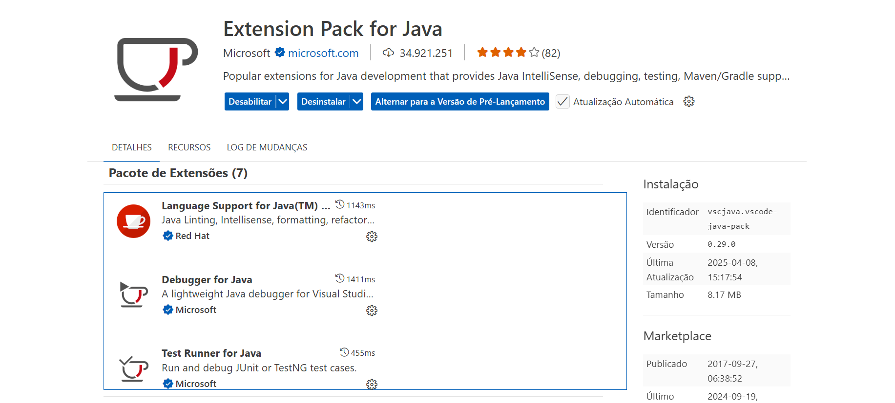
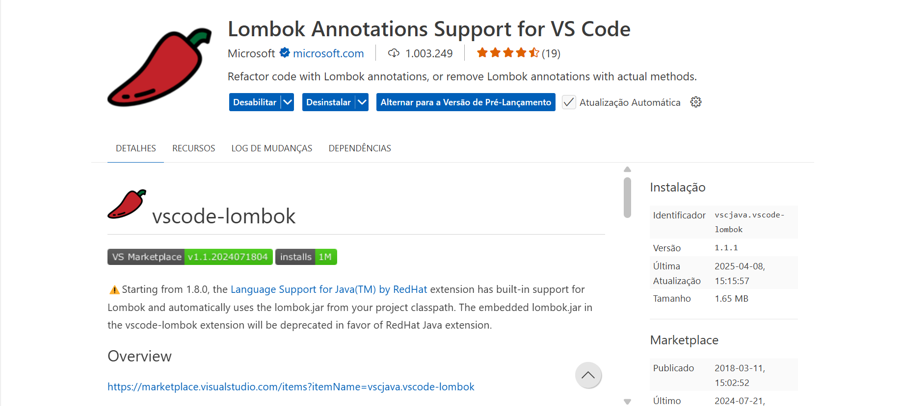

# java-teste-lombok-vscode

# Extensões:
* Clicar no gerenciador de extensões do `VS Code` ou digitar `CTRL + SHIFT + X` e incluir as extensões abaixo:





## Download
* Baixar a bibliotec `Lombok` em:
```
https://projectlombok.org/download
```
## Upload
* Carregar a bibibliotec `Lombok` aqui no `VS Code` do `Codespaces` do `GitHub`.

## Classe Usuário.java
* Criar a classe `Usuário.java` como apresentado abaixo:

```java
import lombok.*;
import java.util.Date; // ou java.time.LocalDate

@Getter 
@ToString
@Builder
public class Usuario {    
    private Long id; 
    private String nome;
    private String sobrenome;
    private String email;
    private Date idade;
    private String genero;
 }
```

## Classe Main.java
* Criar a classe `Main.java` como apresentado abaixo:

```java
import java.util.Date;

public class Main {
    public static void main(String[] args) {
        Usuario usuario1, usuario2;
        
        usuario1 = Usuario.builder().nome("Ana").build();
        System.out.println("Usuário(a) " + usuario1.getNome() + ": " + usuario1.toString());

        usuario2 = Usuario.builder()
                .nome("Diana")
                .sobrenome("Silva")
                .email("ana.silva@example.com")
                .idade(new Date())
                .genero("Feminino")
                .build();
        System.out.println("Usuário(a) " + usuario2.getNome() + ": " + usuario2.toString());

        if (usuario1.equals(usuario1))
            System.out.println("O objeto \'usuario1\' é igual a si próprio!");
        if (usuario2.equals(usuario2))
            System.out.println("O objeto \'usuario2\' é igual a si próprio!");
        if (!usuario1.equals(usuario2))
            System.out.println("Os objetos \'usuario1\' e \'usuario2\' são diferentes!");

        System.out.println("Hash code do objeto \'usuario1\': " + usuario1.hashCode());
        System.out.println("Hash code do objeto \'usuario2\': " + usuario2.hashCode());
    }
}
```

# Compilar
* Compilar as classes usando o comando abaixo:
```
javac -cp lombok.jar -p lombok.jar Usuario.java Main.java 
```
__OBS__:
* `-cp`: (__classpath__) usado para classes e bibliotecas no modelo tradicional (não modular).
* `-p`: (__module-path__) usado para arquivos `JAR` configurados como módulos no novo sistema modular (__Project Jigsaw__).

# Executar
* Executar o programa usando o comando abaixo:
```
java Main
```

# Git & GitHub
Enviar o código para o `GitHub` usando o `Git`:
```
git add .
```

```
git commit -m "Exemplo de programa Java com a biblioteca Lombok."
```

```
git push
```
